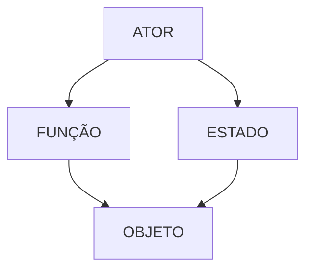
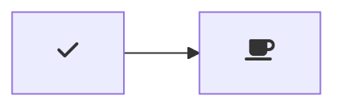
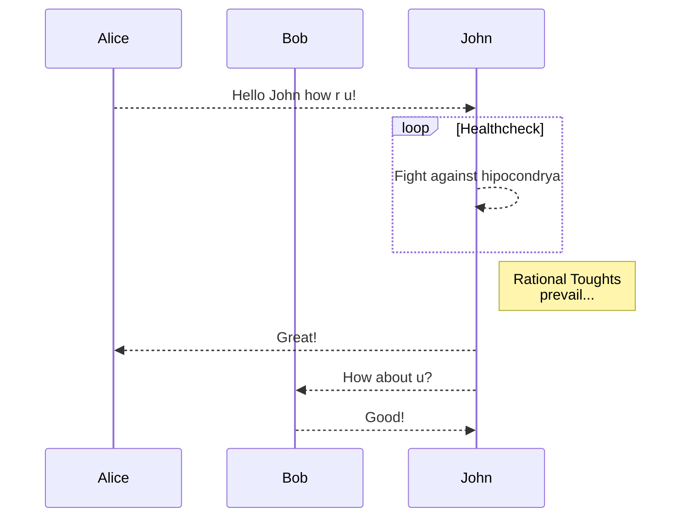

# Exemplos e tutoriais


# Um Jogo

Lorem ipsum odor amet, consectetuer adipiscing elit. Congue dictumst eleifend sapien magnis commodo nec dapibus mattis penatibus. Taciti praesent porta scelerisque habitasse tincidunt porta. Enim per curae aliquet mollis taciti est mus. Taciti leo egestas nam justo leo. Dapibus luctus maecenas dapibus ut cras. Vulputate adipiscing facilisis velit bibendum quis etiam nisi magnis.

**texto em negrito**

*Uma lista não ordenada - itálico*

- Item
- Item
- Item

*Uma lista ordenada*

> Lorem ipsum odor amet, consectetuer adipiscing elit. Congue dictumst eleifend sapien magnis commodo nec dapibus mattis penatibus. Taciti praesent porta scelerisque habitasse tincidunt porta. Enim per curae aliquet mollis taciti est mus. Taciti leo egestas nam justo leo. Dapibus luctus maecenas dapibus ut cras. Vulputate adipiscing facilisis velit bibendum quis etiam nisi magnis.

```

Lorem ipsum odor amet, consectetuer adipiscing elit. Congue dictumst eleifend sapien magnis commodo nec dapibus mattis penatibus. Taciti praesent porta scelerisque habitasse tincidunt porta. Enim per curae aliquet mollis taciti est mus. Taciti leo egestas nam justo leo. Dapibus luctus maecenas dapibus ut cras. Vulputate adipiscing facilisis velit bibendum quis etiam nisi magnis.

```


---
# Análise

- Definir o que é o sistema
    - o que pertence ao sistema
    - do que é feito 
    - quais as partes

- Atores
    - Quem atua sobre o sistema?
    - Quem é ativo no sistema (faz coisas)
    - Não precisam ser só pessoas
    - É importante definir a classe deles (que tipo de ator é esse)
    -  Demias objetos/partes que compõem o sistema
        - Classificar também as partes (dar nomes aos tipos)

---




---
# Estados
## Exemplo:

```mermaid
flowchart LR
A((fa:fa-t)) --- B(explorando)
B ---|encontrar chave| C(Escapando)
B ---|encontrou inimigo| D(Combatendo)
D ---|sobreviveu|A
C & D ---|morreu| E(((fa:fa-t)))
D ---|sobreviveu| C
C ---|encontrou inimigo|D
style A fill:#000000
style B fill:#FFFFFF,stroke:#000000,stroke-width:1px
style C fill:#FFFFFF,stroke:#000000
style D fill:#FFFFFF,stroke:#000000
style E fill:#000000,stroke:#FFFFFF,stroke-width:3.5
```

----
